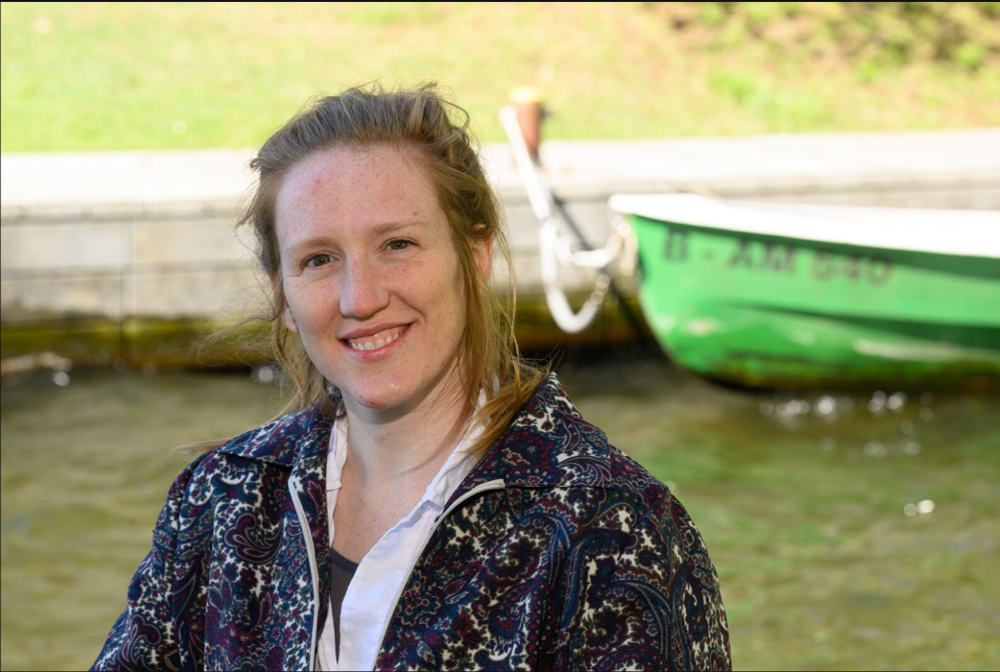

```{=html}
<section class="hero-split">
  <div class="hero-photo">
    <div class="hero-social">
      <a href="mailto:erika.freeman@igb-berlin.de" aria-label="Email"><i class="bi bi-envelope-fill"></i></a>
      <a href="https://github.com/erikacfreeman" aria-label="GitHub"><i class="bi bi-github"></i></a>
      <a href="https://www.linkedin.com/in/erikacfreeman/" aria-label="LinkedIn"><i class="bi bi-linkedin"></i></a>
      <a href="https://bsky.app/profile/erikacfreeman.bsky.social" aria-label="Bluesky"><svg viewBox="0 0 568 501" width="17" height="15" fill="currentColor" aria-hidden="true"><path d="M123.121 33.664C188.241 82.553 258.281 181.68 284 234.873c25.719-53.193 95.759-152.32 160.879-201.21C491.866-1.611 568-28.906 568 57.947c0 17.346-9.945 145.713-15.778 166.555-20.275 72.453-94.155 90.933-159.875 79.748C507.222 323.8 536.444 388.56 473.333 453.32c-119.86 122.992-172.272-30.859-185.702-70.281-2.462-7.227-3.614-10.608-3.631-7.733-.017-2.875-1.169.506-3.631 7.733-13.43 39.422-65.842 193.273-185.702 70.281-63.111-64.76-33.89-129.52 80.986-149.071-65.72 11.185-139.6-7.295-159.875-79.748C9.945 203.66 0 75.293 0 57.947 0-28.906 76.135-1.611 123.121 33.664Z"/></svg></a>
      <a href="https://scholar.google.com/citations?user=E6WubOUAAAAJ" aria-label="Google Scholar"><i class="bi bi-mortarboard-fill"></i></a>
    </div>
    
  </div>
  <div class="hero-content">
    <div class="hero-eyebrow">From Molecular Analysis to Environmental Impact</div>
    <h1 class="hero-name">
      <span class="hero-dr">Dr.</span>
      <span>Erika C.</span>
      <span>Freeman</span>
      <span class="title">Carbon Biogeochemist</span>
    </h1>
  </div>
</section>
```

::: {.bio-section}
::: {.bio-grid}
::: {.bio-col}
[Bio]{.bio-label}

::: {.bio-text}
I'm Erika, a researcher at the [Leibniz-Institut für Gewässerökologie und Binnenfischerei (IGB)](https://www.igb-berlin.de) in Berlin. I study how carbon moves through aquatic systems and what this means for human wellbeing. Most of my days go to *the ecology of molecules*, an idea I love that brings ecological thinking to molecular biogeochemistry.

Before IGB I trained at some wonderful places: a postdoc at Eawag, the ETH Domain's Swiss Federal Institute of Aquatic Science and Technology, and a PhD in biogeochemistry (2024) at the University of Cambridge, where I was a [Gates Cambridge Fellow](https://www.gatescambridge.org/biography/14622/). I'm grateful to the brilliant people who shaped me along the way, and just as happy to have taken what they taught me and run somewhere of my own.

Outside the lab I've worn a few other hats too: life-cycle assessments at a UK food-tech start-up (Foodsteps) and corporate waste management back in Canada (Hydro One).

And when I'm not at the office, you'll usually find me doing irresponsible amounts of running and climbing, or out exploring the great out-the-door with my partner.
:::
:::

::: {.bio-col .bio-list}
[My passions]{.bio-label}

Scientific rigour, ecosystem management, teamwork and collaboration, fun and comedy, women's rights and equity, mental and physical wellbeing, and community and kindness.
:::

::: {.bio-col .bio-list}
[My expertise]{.bio-label}

- Advanced analytical chemistry techniques
- Environmental monitoring
- Data analysis and interpretation
- Logistics and fieldwork
- Project management
- Cross-sector collaboration
:::
:::

```{=html}
<div class="bio-decoration" aria-hidden="true">
  <svg viewBox="0 0 720 480" xmlns="http://www.w3.org/2000/svg" fill="none">
    <title>Caffeine, 1,3,7-trimethylpurine-2,6-dione</title>
    <style>
      .bond { stroke: currentColor; stroke-width: 5.6; stroke-linecap: round; stroke-linejoin: round; }
      .double { stroke: currentColor; stroke-width: 3.8; stroke-linecap: round; stroke-linejoin: round; }
      .atom { fill: currentColor; font-family: Inter, Arial, sans-serif; font-size: 31px; font-weight: 650; text-anchor: middle; dominant-baseline: middle; }
      .small { fill: currentColor; font-family: Inter, Arial, sans-serif; font-size: 27px; font-weight: 650; text-anchor: middle; dominant-baseline: middle; }
    </style>
    <g transform="translate(3 0)">
      <line class="bond" x1="250" y1="143" x2="330" y2="95"/>
      <line class="bond" x1="330" y1="95" x2="430" y2="155"/>
      <line class="bond" x1="430" y1="155" x2="430" y2="285"/>
      <line class="bond" x1="430" y1="285" x2="350" y2="333"/>
      <line class="bond" x1="310" y1="333" x2="230" y2="285"/>
      <line class="bond" x1="230" y1="285" x2="230" y2="177"/>
      <line class="bond" x1="430" y1="155" x2="515" y2="131"/>
      <line class="bond" x1="549" y1="144" x2="612" y2="225"/>
      <line class="bond" x1="612" y1="225" x2="548" y2="309"/>
      <line class="bond" x1="516" y1="317" x2="430" y2="285"/>
      <line class="double" x1="349" y1="118" x2="414" y2="157"/>
      <line class="double" x1="413" y1="274" x2="413" y2="171"/>
      <line class="double" x1="558" y1="157" x2="594" y2="204"/>
      <line class="double" x1="509" y1="302" x2="450" y2="281"/>
      <line class="bond" x1="330" y1="95" x2="330" y2="42"/>
      <line class="double" x1="342" y1="101" x2="342" y2="49"/>
      <text class="atom" x="317" y="33">O</text>
      <line class="bond" x1="230" y1="285" x2="172" y2="318"/>
      <line class="double" x1="224" y1="270" x2="166" y2="303"/>
      <text class="atom" x="126" y="336">O</text>
      <line class="bond" x1="210" y1="143" x2="162" y2="116"/>
      <text class="small" x="105" y="105">CH3</text>
      <line class="bond" x1="330" y1="365" x2="330" y2="410"/>
      <text class="small" x="330" y="444">CH3</text>
      <line class="bond" x1="543" y1="106" x2="560" y2="62"/>
      <text class="small" x="587" y="48">CH3</text>
      <text class="atom" x="230" y="155">N</text>
      <text class="atom" x="330" y="345">N</text>
      <text class="atom" x="535" y="125">N</text>
      <text class="atom" x="535" y="325">N</text>
      <text class="small" x="640" y="225">H</text>
    </g>
  </svg>
</div>
```
:::
