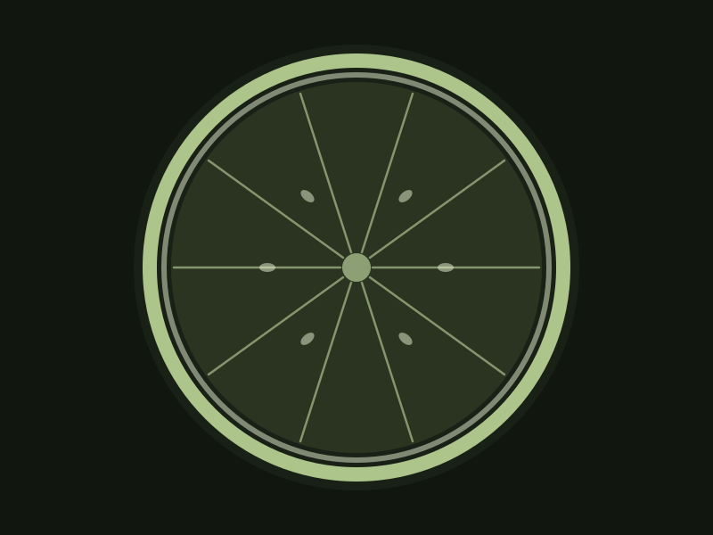

::: {.section-label}
Personal projects
:::

# off the clock {.section-title}

The things I make and chase when I'm not at the bench. Each opens its working folder in Drive.

```{=html}
<div class="projects-grid">
  <a class="project-card" href="https://drive.google.com/drive/folders/15nowp-VkPrbWb-wEvvo4aWEtFuV0YZB_" target="_blank" rel="noopener">
    <div class="project-figure"></div>
    <div class="project-body">
      <h2 class="project-title">Adventure</h2>
      <p class="project-desc">Running, climbing, and the great out-the-door, currently training toward a sub-3:30 marathon. <span class="card-cta">Open in Drive →</span></p>
    </div>
  </a>
  <a class="project-card" href="https://drive.google.com/drive/folders/1vYOA1K6MltYL6QiZyjtnVZe0JX-jKdaZ" target="_blank" rel="noopener">
    <div class="project-figure"><span class="figure-text">Travel</span></div>
    <div class="project-body">
      <h2 class="project-title">Travel</h2>
      <p class="project-desc">Field trips, conferences, and a deep love of Argentina. <span class="card-cta">Open in Drive →</span></p>
    </div>
  </a>
  <a class="project-card" href="https://drive.google.com/drive/folders/1qEL7wdN14cPtcwRmQ2yFl87FMbS-bCDh" target="_blank" rel="noopener">
    <div class="project-figure"></div>
    <div class="project-body">
      <h2 class="project-title">Table of Contents</h2>
      <p class="project-desc">A themed dinner series with Juli. CITR·US is the citrus strand. <span class="card-cta">Open in Drive →</span></p>
    </div>
  </a>
</div>
```

::: {.personal-link}
[← Back to projects](projects.html)
:::
