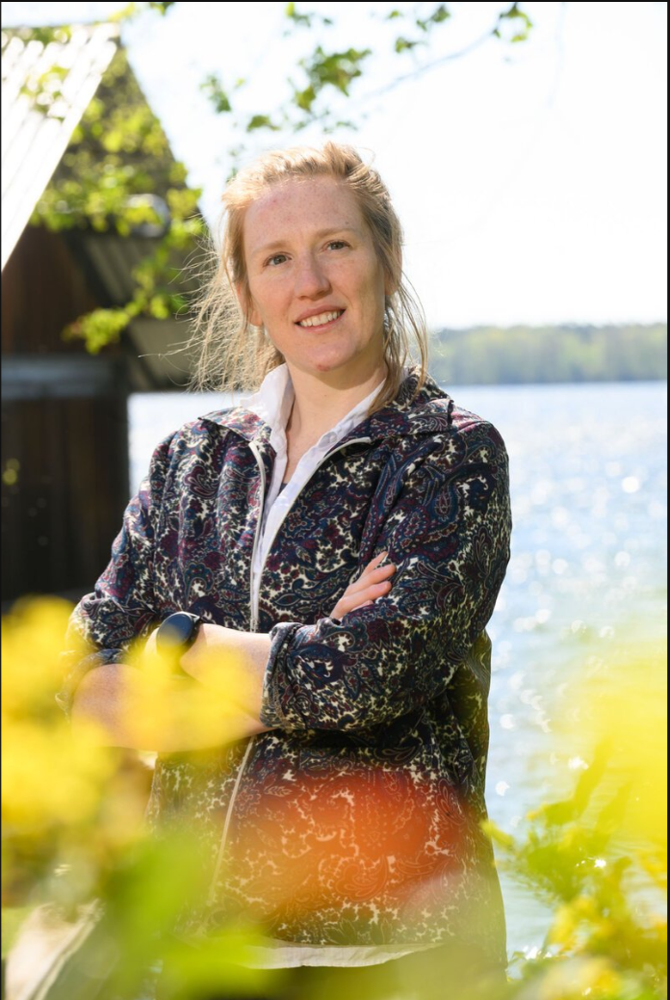

::: {.section-label}
Projects
:::
::: {.section-title}
Projects
:::

::: {.projects-grid}

::: {.project-card}
::: {.project-figure}

:::
::: {.project-body}
::: {.project-title}
An Ecology of Molecules
:::
::: {.project-desc}
A new field bridging molecular biogeochemistry with ecosystem science. Applying ecological theory to environmental metabolomics so that the thousands of molecules in dissolved organic matter can be read as an ecological community.
:::
:::
:::

::: {.project-card}
::: {.project-figure}

:::
::: {.project-body}
::: {.project-title}
Predictive Ecology
:::
::: {.project-desc}
Moving freshwater science from describing ecosystems to forecasting them. I co-lead work that pairs ecological theory with bleeding-edge, high-resolution data to anticipate how carbon cycling and water quality respond as the world changes.
:::
:::
:::

::: {.project-card}
::: {.project-figure}

:::
::: {.project-body}
::: {.project-title}
Precision Biogeochemistry
:::
::: {.project-desc}
AI-assisted pipelines that annotate the thousands of molecules in a single sample, turning raw FT-ICR-MS spectra into meaningful biogeochemistry: a faster, more reproducible, more precise way to read organic matter at molecular scale.
:::
:::
:::

::: {.project-card}
::: {.project-figure}

:::
::: {.project-body}
::: {.project-title}
Carbon on the Move
:::
::: {.project-desc}
How carbon lost from soils into waters under land-use change rewires freshwater chemistry, from boreal forests to temperate lakes, and what it means for ecosystem function.
:::
:::
:::

::: {.project-card}
::: {.project-figure}

:::
::: {.project-body}
::: {.project-title}
Carbon in Practice
:::
::: {.project-desc}
Keeping one foot in the real world of carbon. From life-cycle assessment at a food-tech start-up to corporate environmental work, I care about the seam where molecular science meets carbon accounting, MRV (measurement, reporting, verification), and real climate decisions.
:::
:::
:::

::: {.project-card}
::: {.project-figure}

:::
::: {.project-body}
::: {.project-title}
A Kinder Academia
:::
::: {.project-desc}
Writing about and working to change the conditions of academic life, from the Science Working Life essay on having children in academia (with Cecilia Padilla-Iglesias) to ongoing work on equity and mentorship.
:::
:::
:::

::: {.project-card}
::: {.project-figure}

:::
::: {.project-body}
::: {.project-title}
Outside
:::
::: {.project-desc}
Running, climbing, botanising. The other half of why this work matters.
:::
:::
:::

:::
