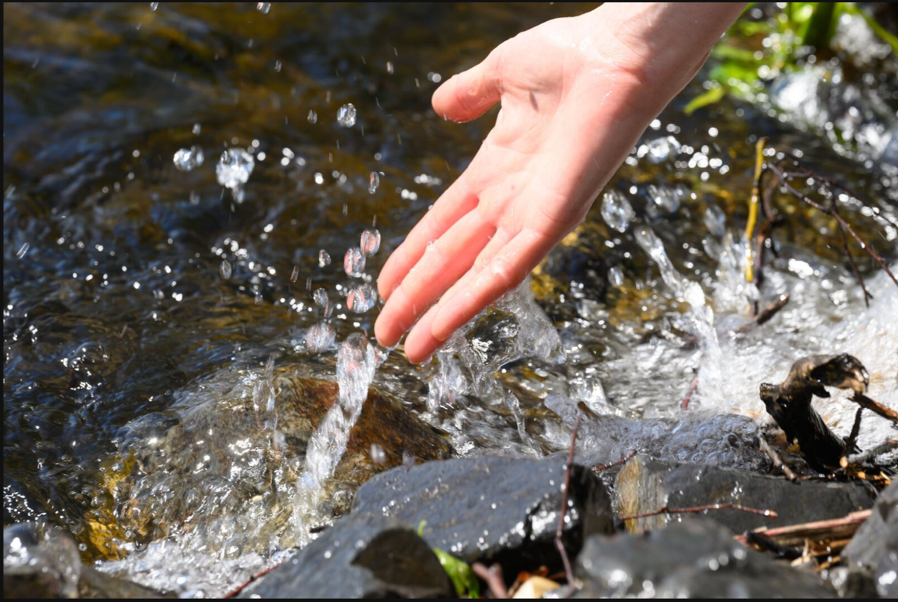

::: {.section-label}
Projects
:::
::: {.section-title}
Projects
:::

::: {.projects-grid}

::: {.project-card}
::: {.project-figure}
The ecology of molecules
:::
::: {.project-body}
::: {.project-title}
The Ecology of Molecules
:::
::: {.project-desc}
A new field bridging molecular biogeochemistry with ecosystem science. Applying ecological theory to environmental metabolomics so that the thousands of molecules in dissolved organic matter can be read as an ecological community.
:::
:::
:::

::: {.project-card}
::: {.project-figure}

:::
::: {.project-body}
::: {.project-title}
Global Ecosystem Change
:::
::: {.project-desc}
How carbon lost from soils into waters under land-use change rewires freshwater chemistry — from boreal forests to temperate lakes — and what it means for ecosystem function.
:::
:::
:::

::: {.project-card}
::: {.project-figure}
Corporate ecosystem mgmt
:::
::: {.project-body}
::: {.project-title}
Corporate Ecosystem Management
:::
::: {.project-desc}
[Page under development]{.project-coming-soon}
:::
:::
:::

::: {.project-card}
::: {.project-figure}
Improving academia
:::
::: {.project-body}
::: {.project-title}
Improving Academia
:::
::: {.project-desc}
Writing about and working to change the conditions of academic life — from the Science Working Life essay on having children in academia (with Cecilia Padilla-Iglesias) to ongoing work on equity and mentorship.
:::
:::
:::

::: {.project-card}
::: {.project-figure}

:::
::: {.project-body}
::: {.project-title}
The Living Lab — Hunziker
:::
::: {.project-desc}
*Add a short description here — currently a placeholder.*
:::
:::
:::

::: {.project-card}
::: {.project-figure}

:::
::: {.project-body}
::: {.project-title}
Outside
:::
::: {.project-desc}
Running, climbing, botanising. The other half of why this work matters.
:::
:::
:::

:::
